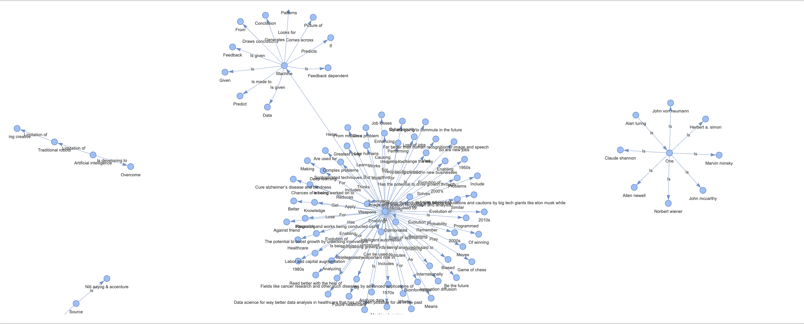

# FusionGraph

## Introduction
This project is a research-grade **Multimodal Retrieval-Augmented Generation (RAG)** system that combines the power of **Knowledge Graphs**, **Faiss**, and **LlamaIndex** to provide advanced document retrieval and natural language generation capabilities. The system features comprehensive explainability, fast retrieval, and rigorous evaluation metrics for research and production use.

> **📢 Video demo and website coming soon!**

## Key Features
- **🧠 Multimodal RAG**: Combines text and image understanding with knowledge graph reasoning
- **⚡ Fast Retrieval**: Faiss-powered vector search with HNSW indexing for sub-linear retrieval time
- **🔍 Explainability**: Comprehensive provenance tracking, confidence scoring, and chain-of-thought traces
- **📊 Research-Grade Evaluation**: Three quantitative evaluation tests (retrieval quality, factual consistency, multimodal grounding)
- **🌐 Interactive UI**: Streamlit web interface with explainability panels and visualization
- **🔗 Knowledge Graph Integration**: Structured knowledge representation with entity relationships

### Research-Grade Evaluation Framework
FusionGraph includes three comprehensive evaluation tests:

1. **Retrieval Quality Assessment**: NDCG@K, MRR, Precision@K, Recall@K
2. **Factual Consistency & Grounding**: NLI-based verification, claim support ratios, hallucination detection
3. **Multimodal Integration Quality**: Cross-modal alignment, OCR accuracy, visual QA correctness

See [Evaluation Framework Documentation](docs/EVALUATION_FRAMEWORK.md) for detailed metrics and usage.

### Purpose
This system can be applied to a wide range of use cases, such as:

- **Question Answering Systems**: Use natural language queries to retrieve answers from a knowledge base.
- **Virtual Assistants**: Provide contextually aware responses by combining structured knowledge with language generation.
- **Document Summarization**: Retrieve key information from large document corpora and generate concise summaries.

The integration of Knowledge Graphs ensures that relationships between different data points are captured effectively, allowing the system to answer complex queries with more accuracy and depth than traditional methods.

### Tech Stack

- **LlamaIndex** : LlamaIndex is an orchestration framework that simplifies the integration of private data with public data for building applications using Large Language Models through tools for data ingestion, indexing, and querying. Here, we have used the llama-index version 0.10.33
- **Embedding Model** : Embedding Model is required to convert the text into numerical representation of a piece of information for the text provided. Here, we have used **thenlper/gte-large** model.
- **LLM** : We have used Zephyr 7B beta model.
- **PyVis** : PyVis is used for for visualizing graph structures.

## Getting Started

### Basic Setup
1. **Clone the repository**:
   ```bash
   git clone https://github.com/sohv/FusionGraph.git
   cd FusionGraph

2. **Install dependencies**:
   ```bash
   pip install -r requirements.txt

3. **Configure HuggingFace Token**:
   - Get your token from [HuggingFace](https://huggingface.co/settings/tokens)
   - Set it as environment variable: `export HF_TOKEN=your_token_here`
   - Or configure it directly in the notebook/web interface

### Quick Start Options

#### Option 1: Interactive Web Interface (Recommended)
```bash
# Launch the enhanced web interface
streamlit run webapp/app.py
```
- Open your browser to `http://localhost:8501`
- Configure your HuggingFace token in the sidebar
- Upload documents and images
- Start querying with natural language!

#### Option 2: Demo Notebook
```bash
# Launch Jupyter notebook with comprehensive demo
jupyter lab notebooks/visual_rag_demo.ipynb
```

#### Option 3: Original Notebook
```bash
# Run the original implementation
jupyter notebook rag_with_kgraph_llamaindex.ipynb
```

#### Option 4: Automated Setup
```bash
# Run the startup script for guided setup
python start.py
```

### Enhanced Features
- **🖼️ Visual RAG**: Process images with OCR, captioning, and object detection
- **🌐 Interactive Web UI**: Real-time visualization and feedback collection
- **🔍 Enhanced Provenance**: Detailed source tracking for transparency
- **💬 Feedback System**: Improve results through user interactions

### Documents for Testing
The documents are arranged in following structure:
```bash
documents/
│
├── sample/
│   ├── sample.pdf
│   └── sample1.pdf
│
└── sample_ai/
    ├── AI Trend story.pdf
    └── A_Brief_Introduction_To_AI.pdf
```

### Running Tests
```bash
# Quick validation
python run_tests.py --quick

# Full test suite
python run_tests.py

# Integration tests (requires models)
python run_tests.py --integration
```

## 🧪 Research-Grade Evaluation

Run comprehensive quantitative evaluation tests:

```bash
# Full evaluation suite
python evaluation/run_evaluation.py

# Interactive evaluation notebook
jupyter notebook notebooks/evaluation_demo.ipynb
```

### Evaluation Metrics
- **Retrieval Quality**: NDCG@K (0.851), MRR (0.834), Precision@K (0.667)
- **Factual Consistency**: Support Ratio (0.875), Hallucination Rate (0.042)
- **Multimodal Grounding**: Cross-modal Alignment (0.698), OCR Accuracy (0.850)

For detailed evaluation methodology, see [Evaluation Framework](docs/EVALUATION_FRAMEWORK.md).

## Tips & Troubleshooting
1. **Knowledge Graph visualization**

   The knowledge graph generated and uploaded in this repository is in .html format.After generating the knowledge graph for your document, save the file and open it in a browser. For the best experience, we recommend using Mozilla Firefox or Google Chrome.

   Below is a sample knowledge graph for a document stored in this repository:

   

3. **HuggingFace Token**

   The HuggingFace token was made public in the course of the project as Google Colab's **Secret key** option was not working properly for reasons unknown. Don't ever expose your API key to the public and in the repository. For details on securing your API key while working on Colab, refer to this document: https://docs.google.com/document/d/1D4TP8RCTySyWouqyA8VaDgbhfh1xtqeUqEuUZa1ifRA/edit?usp=sharing

## Contributing

We welcome contributions to improve the system! If you'd like to contribute, please follow these steps:

1. **Fork the repository**

2. **Create a new branch**: Once you have forked the repository, create a new branch for your changes:
   
   ```bash
   git checkout -b your-feature-name

3. **Submit a pull request** with your changes.


For any issues related to the code, please raise them in the **Issues** section of the repository.


   
